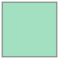

```python
import geopandas as gpd
from shapely.geometry import Polygon, LineString, Point
```


```python
x1 ,y1 = 1,2
x2, y2 = 2,2
x3, y3 = 2,3
x4, y4 = 1,3
```


```python
Point([x1,y1])
```


    

    


```python
LineString([(x1,y1),(x3,y3)])
```


    

    


```python
Polygon([(x1,y1),(x2,y2),(x3,y3),(x4,y4)])
```


    

    


```python
Polygon(sorted([(x1,y1),(x2,y2),(x4,y4),(x3,y3)]))
```


    

    


```python
import matplotlib.pyplot as plt

point = Point([x1,y1])
line = LineString([(x1,y1),(x3,y3)])
polygon = Polygon([(x1,y1),(x2,y2),(x3,y3),(x4,y4)])

ax = gpd.GeoSeries(polygon).plot( color='black', alpha=0.5)
gpd.GeoSeries(line).plot(ax=ax, linewidth=3, color='white')
gpd.GeoSeries(point).plot(ax=ax, color='red', markersize=100)
plt.axis('off')
plt.show()
print(point.geom_type)
print(line.geom_type)
print(polygon.geom_type)
```


    

    


    Point
    LineString
    Polygon
    


코드 정리

# 코드정리

## 코드정리

**진하게**

# 크게


```python

```
